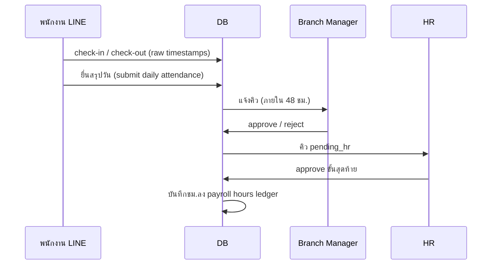

# Phase 5 Plan — Multi-Branch, Two-Tier Approval & Payroll Hours

**Status:** ⏳ **PENDING REVIEW** — T76–T95 MVP complete 2026-06-10  
**Date:** 2026-06-10  
**Source:** Client requirements (conversation 2026-06-10)  
**Depends on:** Phase 1–4 (T01–T75) — Phase 4 ⏳ pending review  
**Production base:** https://hr-app-two-iota.vercel.app

---

## Client Requirements (Locked)

| # | หัวข้อ | กติกา |
|---|--------|--------|
| R1 | **โครงสร้างองค์กร** | **สาขา (Branch) > แผนก (Department)** — มีหลายสาขา |
| R2 | **Branch Manager** | **1 สาขา : 1 manager** (ไม่ดูแลหลายสาขา) |
| R3 | **Check-in / Check-out** | อนุมัติ**ทุกวัน** — ส่งคิวหลังพนักงานยื่น; ต้องดำเนินการภายใน **48 ชม.** นับจากเวลายื่น |
| R4 | **ลาป่วยย้อนหลัง** | ได้ **ไม่เกิน 3 วัน** — **ต้องแนบใบรับรองแพทย์** |
| R5 | **OT** | **Branch Manager เป็นผู้ยื่นคำขอ OT** (ให้พนักงานในสาขา) — ไม่ใช่พนักงานยื่นเอง |
| R6 | **หน่วยการลา** | ลาทั่วไปนับ **วัน**; **ลาป่วยภายในวัน** นับ **ชม.** |
| R7 | **Approval chain** | ทุกเรื่อง (ชม.ทำงาน, OT, ลา): **Branch Manager → HR (ขั้นสุดท้าย)** |
| R8 | **Payroll** | สรุปจาก **ชม.การทำงานที่อนุมัติแล้ว + OT ที่อนุมัติแล้ว** (ยังไม่คำนวณเงินเป็นบาทใน Phase 5) |

---

## Gap จากระบบปัจจุบัน

| ปัจจุบัน | Phase 5 |
|----------|---------|
| Role: `employee` / `hr` / `admin` | + `branch_manager` |
| `department` เป็น text | `hr_branches` + `hr_departments` (FK) |
| Check-in/out บันทึกทันที | ยื่น → `pending_manager` → `pending_hr` → `approved` |
| ลา/OT: HR อนุมัติขั้นเดียว | สองขั้น + กติกาลาป่วยย้อนหลัง / ชม. |
| OT: พนักงานยื่นผ่าน LIFF | BM ยื่นแทนทีมในสาขา |
| Payroll Hub: ดู salary อย่างเดียว | Ledger ชม.ปกติ + OT รายงาน payroll |

---

## Architecture

### Org model

```
hr_branches (id, name, code, manager_employee_id UNIQUE)
    └── hr_departments (id, branch_id, name)
            └── hr_employees (branch_id, department_id, role)
```

- `manager_employee_id` ต้องเป็น role `branch_manager` และ **unique** (1 สาขา 1 คน)
- พนักงานทุกคนอยู่สาขาเดียว; แผนกอยู่ภายใต้สาขา

### Approval state machine (shared)

```
submitted → pending_manager → pending_hr → approved
                ↓                ↓
            rejected         rejected
                ↓
         expired (>48h จาก submitted_at — ต้องยื่นใหม่)
```

ใช้กับ: `hr_attendance_submissions`, `hr_leaves`, `hr_overtime_requests` (ขยาย schema เดิม)

### Attendance daily flow



- `work_hours` นับจาก check-in/out ที่อนุมัติแล้วเท่านั้น
- Cron: แจ้งเตือน manager ใกล้ครบ 48 ชม.; mark `expired` ถ้าเลยกำหนด

### Leave rules

| ประเภท | หน่วย | กติกาเพิ่ม |
|--------|------|-----------|
| ลาทั่วไป (annual, personal, …) | **วัน** | สองขั้นอนุมัติ |
| ลาป่วยย้อนหลัง | **วัน** | `start_date` ย้อนหลัง ≤ 3 วัน + **ใบรับรองแพทย์บังคับ** |
| ลาป่วยภายในวัน | **ชม.** | ฟิลด์ `leave_hours` + `start_date = end_date` |

### OT flow

- **ปิด** LIFF OT สำหรับพนักงาน (หรือ redirect ข้อความ "ติดต่อหัวหน้าสาขา")
- **Branch Manager** สร้างคำขอ OT ใน `/admin/manager/overtime` เลือกพนักงานในสาขา
- BM approve ขั้นแรก (self-submit → auto pending_hr หรือ BM submit แล้วไป HR โดยตรง — **แนะนำ:** submit แล้วไป `pending_hr` เลย เพราะ BM เป็นผู้ยื่น; ถ้าต้องการ BM ลงนามก่อนส่ง HR ใช้ `pending_hr` หลัง BM confirm)
- **Default design:** BM ยื่น → `pending_hr` (BM ไม่ต้อง approve ตัวเอง) → HR อนุมัติขั้นสุดท้าย  
  - *ถ้าต้องการ BM approve ก่อนส่ง HR แจ้ง Cursor ก่อน implement*

### Payroll hours (no baht calc)

- ตาราง `hr_payroll_periods` + `hr_payroll_hour_lines`
- รวมชม.จาก attendance `approved` + OT `approved` + ลาป่วยรายชม.
- Export CSV รายเดือนต่อสาขา/แผนก

---

## Milestones (~8–10 weeks)

### M21: Branch & Roles — ~1.5 weeks

| ID | Task | Agent | Deliverables |
|----|------|-------|--------------|
| T76 | Schema `hr_branches`, `hr_departments` FK, migrate จาก `department` text | Claude Code | migration + seed pattern |
| T77 | Role `branch_manager` + `hr_is_branch_manager()` + RLS ตามสาขา | Claude Code | auth helpers |
| T78 | Admin UI: จัดการสาขา / แผนก / มอบหมาย manager | Codex | `/admin/branches` |

**Acceptance:** สร้างสาขาได้; 1 manager ต่อ 1 สาขา; พนักงานผูก branch+dept

---

### M22: Approval Engine — ~1 week

| ID | Task | Agent | Deliverables |
|----|------|-------|--------------|
| T79 | Shared approval columns + status enum + audit trail | Claude Code | migration |
| T80 | APIs: manager decide / HR decide / 48h expiry edge fn | Claude Code | routes + cron |

**Acceptance:** state machine ใช้ร่วมกันได้; expired หลัง 48 ชม.

---

### M23: Attendance Daily Approval — ~1.5 weeks

| ID | Task | Agent | Deliverables |
|----|------|-------|--------------|
| T81 | ยื่นสรุปวัน (submit) หลัง check-out + pending queue | Claude Code | API + LINE |
| T82 | Manager queue UI + HR final queue | Codex | `/admin/manager/attendance`, HR view |
| T83 | บันทึกชม.ลง ledger เมื่อ HR approve | Claude Code | payroll hours hook |

**Acceptance:** ชม.นับเฉพาะวันที่ HR approve; เกิน 48 ชม. → expired

---

### M24: Leave Rules — ~1.5 weeks

| ID | Task | Agent | Deliverables |
|----|------|-------|--------------|
| T84 | ลาป่วยย้อนหลัง ≤3 วัน + ใบรับรองแพทย์บังคับ | Claude Code | validation + storage |
| T85 | ลาป่วยรายชม. (same-day hours) | Claude Code | schema + LIFF form |
| T86 | Leave two-tier approval + manager/HR queues | Claude Code | แทน decide เดิม |

**Acceptance:** ย้อนหลัง 4 วัน reject; ไม่มีใบรับรอง reject; ลาทั่วไปเป็นวัน

---

### M25: OT via Branch Manager — ~1 week

| ID | Task | Agent | Deliverables |
|----|------|-------|--------------|
| T87 | BM-only OT submit UI + ปิด employee LIFF OT | Claude Code | manager OT form |
| T88 | OT HR final approval + OT hours ใน ledger | Claude Code | integrate M22 |

**Acceptance:** พนักงานยื่น OT เองไม่ได้; OT อนุมัติแล้วรวมในรายงานชม.

---

### M26: Payroll Hours Report — ~1 week

| ID | Task | Agent | Deliverables |
|----|------|-------|--------------|
| T89 | Payroll period + hour lines aggregation | Claude Code | migration + queries |
| T90 | `/admin/payroll` รายงานชม. + CSV export ต่อสาขา | Codex | แทน hub เดิม |

**Acceptance:** HR export ชม.ปกติ + OT + ลาป่วยชม. รายเดือน

---

### M27: Notifications & Manager Home — ~1 week

| ID | Task | Agent | Deliverables |
|----|------|-------|--------------|
| T91 | LINE push: คิวรอ manager / HR | Claude Code | flex templates |
| T92 | Branch Manager dashboard (คิวรวม) | Codex | `/admin/manager` |

---

### M28: Phase 5 Hardening — ~1 week

| ID | Task | Agent | Deliverables |
|----|------|-------|--------------|
| T93 | E2E P5 (`run-all-p5.mjs`) | Claude Code | remote harness |
| T94 | Security review P5 | Claude Opus | `SECURITY_REVIEW_P5.md` |
| T95 | Delivery audit P5 | Cursor | `DELIVERY_READINESS_AUDIT_P5.md` |

**Total Phase 5:** 20 tasks (T76–T95) / ~8–10 weeks

---

## Dependency Order

```
T76 → T77 → T78          (org + roles)
T79 → T80                (approval engine)
T81 → T82 → T83          (attendance)
T84 → T85 → T86          (leave)
T87 → T88                (OT)
T89 → T90                (payroll hours)
T91 → T92                (notify + manager UI)
T93 → T94 → T95          (hardening)
```

---

## GROUND_TRUTH Changes (เมื่อ kickoff)

**ยกเลิกข้อห้าม (เฉพาะ Phase 5):**
- ~~multi-branch~~ → อนุญาต `hr_branches`
- ~~payroll calculation~~ → อนุญาต **สรุปชม.**; ยังห้าม **คำนวณเงินเดือนเป็นบาท / สลิป**

**ยังห้าม:**
- Multi-company
- Accounting integration (SAP, SAGE)
- Salary slip PDF generation
- Native mobile app

---

## First Task (หลัง Phase 4 review)

**T76 — Branch & department schema**  
Phase: **PLAN** → dispatch Claude Code skill `03-claude-plan`

Skills: Supabase skill, `12-supabase-migration`, `10-security-review`

---

## Open Points (default ถ้าไม่แจ้งเพิ่ม)

| หัวข้อ | Default |
|--------|---------|
| BM ยื่น OT แล้วส่ง HR เลย หรือ BM approve ตัวเองก่อน? | ยื่น → `pending_hr` (BM เป็นผู้ยื่น) |
| หมดอายุ 48 ชม. | `expired` + แจ้งพนักงานให้ยื่นใหม่ |
| ย้ายข้อมูล `department` text เดิม | map เป็น branch เริ่มต้น 1 สาขา + แผนกจากค่าเดิม |
