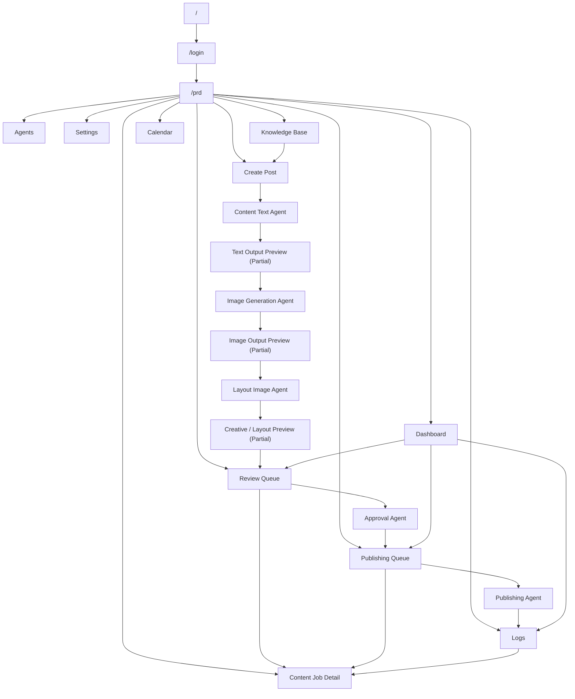

# As-Built Sitemap

Date: 2026-06-08  
Timezone: Asia/Bangkok  
Source documents:
- `docs/CURRENT_APP_INVENTORY.md`
- `docs/AS_BUILT_PRD.md`

## 1. Product Surface Overview

### Main app areas
- Authentication
  - `/login`
- Main product shell
  - `/prd`

### Primary routes
- `/`
- `/login`
- `/prd`

### Secondary `/prd` surfaces
- Dashboard
- Calendar
- Create Post
- Review Queue
- Publishing
- Content Library
- Analytics
- Knowledge Base
- Rules & Brand
- Agents
- Settings
- Logs
- Content Job Detail

### Admin/internal surfaces
- Agents
- Logs
- Settings
- Knowledge Base

### Excluded repo artifact
- `src/app/editor-canvas2/page.tsx`
  - present in repository
  - not part of the `/prd` V1 product flow

## 2. Route Map

### Page routes

| Route path | Page purpose | Related workflow | Current status | Related files |
|---|---|---|---|---|
| `/` | Root entry and redirect | Entry | Implemented | `src/app/page.tsx` |
| `/login` | Sign in and sign up | Authentication | Implemented | `src/app/login/page.tsx`, `src/app/api/auth/sign-in/route.ts`, `src/app/api/auth/sign-up/route.ts` |
| `/prd` | Main command center shell | Create, review, publish, logs | Partial, mock-backed | `src/app/prd/page.tsx` |

### `/prd` surface map

| Surface | Purpose | Related workflow | Current status | Related files |
|---|---|---|---|---|
| Dashboard | Pipeline board, activity, status summary | Monitoring, navigation | Partial, mock-backed | `src/app/prd/page.tsx`, `src/app/api/dashboard/overview/route.ts` |
| Calendar | Scheduling and slot planning | Scheduling | Partial, mock-backed | `src/app/prd/page.tsx`, `src/app/api/calendar/slots/route.ts` |
| Create Post | Main workflow entry | Content creation | Partial | `src/app/prd/page.tsx`, `src/app/api/content/jobs/route.ts` |
| Review Queue | Human approval surface | Review and approval | Partial | `src/app/prd/page.tsx`, `src/app/api/reviews/route.ts`, `src/app/api/reviews/action/route.ts`, `src/app/api/review/decision/route.ts` |
| Publishing | Queue and sync surface | Publishing | Partial | `src/app/prd/page.tsx`, `src/app/api/publishing/queue/route.ts`, `src/app/api/publishing/sync/route.ts` |
| Content Library | Browse/reuse content | Reuse/lookup | Partial | `src/app/prd/page.tsx` |
| Analytics | Post-publish insight surface | Analytics | Partial | `src/app/prd/page.tsx` |
| Knowledge Base | Source processing and RAG | Source ingestion/RAG | Partial | `src/app/prd/page.tsx`, `src/app/api/knowledge/*`, `src/app/api/rag/*` |
| Rules & Brand | Voice/rules context | Governance | Partial | `src/app/prd/page.tsx` |
| Agents | Agent inventory and runtime status | Agent runtime | Partial | `src/app/prd/page.tsx`, `src/app/api/agents/*` |
| Settings | Runtime and integration readiness | Operations | Partial | `src/app/prd/page.tsx`, `src/app/api/health/route.ts`, `src/app/api/runtimes/route.ts` |
| Logs | Audit and troubleshooting | Logs/runtime | Partial | `src/app/prd/page.tsx`, `src/app/api/logs/*` |
| Content Job Detail | Cross-surface workflow detail drawer | Drill-down | Partial | `src/app/prd/page.tsx`, `src/app/api/content/jobs/route.ts` |

## 3. User Navigation Map

Current user navigation:

- `/` -> `/login`
- `/login` -> `/prd`
- `/prd` sidebar opens the main operational surfaces

Core movement inside `/prd`:

- Dashboard -> Review Queue / Publishing / Logs / Content Job Detail
- Create Post -> Source Search / Draft Generation / Image / Layout / Review Queue
- Review Queue -> Publishing / Logs / Content Job Detail
- Publishing -> Content Job Detail / Logs
- Logs -> Content Job Detail

## 4. Core Workflow Map

| Step | Route/page | Current implementation status | Related files | Known limitation |
|---|---|---|---|---|
| Login | `/login` | Implemented | `src/app/login/page.tsx`, auth routes | Main auth UX is narrow |
| Dashboard / PRD Command Center | `/prd` -> Dashboard | Partial, mock-backed | `src/app/prd/page.tsx`, dashboard API | Still mixes live and fallback state |
| Create Post | `/prd` -> Create Post | Partial | `src/app/prd/page.tsx`, content jobs API | Some preview/package steps are still not fully final UX |
| Source Search / RAG | `/prd` -> Create Post / Knowledge Base | Implemented, partial | `src/app/prd/page.tsx`, RAG/knowledge APIs | Depends on indexed sources |
| Draft Generation | `/prd` -> Create Post | Implemented | `src/lib/agents/executeAgentRun.ts`, agent APIs | Output packaging still needs UX normalization |
| Image Output Preview | `/prd` -> Review Queue / Content Job Detail | Partial | `src/app/prd/page.tsx`, reviews API | Real preview exists only when asset reference is present; durable storage remains incomplete |
| Creative / Layout Preview | `/prd` -> Create Post / Review Queue / Content Job Detail | Partial | `src/app/prd/page.tsx`, reviews API | Often shown as brief/summary rather than full preview |
| Review | `/prd` -> Review Queue | Partial | `src/app/prd/page.tsx`, review APIs | Must avoid raw payload-style output |
| Publishing Queue | `/prd` -> Publishing | Partial | `src/app/prd/page.tsx`, publishing APIs | Environment-dependent |
| Logs | `/prd` -> Logs | Partial | `src/app/prd/page.tsx`, logs APIs | Technical/operational presentation may be too developer-facing |

## 5. User-Facing Output Surfaces

| Surface name | Route/page | Related feature | Output type | Current output status | User impact | Related files |
|---|---|---|---|---|---|---|
| Create Post - Generated Text | `/prd` -> Create Post | Content generation | content text | UI-readable, Partial | Readable draft cards exist, but preview/package behavior is still not fully final | `src/app/prd/page.tsx` |
| Create Post - Source Search preview | `/prd` -> Create Post | Source search / RAG | content text / source context | UI-readable | Shows structured preview cards rather than payload dump | `src/app/prd/page.tsx` |
| Create Post - Ready for Review package | `/prd` -> Create Post | Review package assembly | content text, image, layout, approval | Partial | Package is readable, but still metadata-heavy and at risk of payload-shaped presentation | `src/app/prd/page.tsx` |
| Review Queue - Split-view editor | `/prd` -> Review Queue | Review/approval | content text, image, approval | UI-readable, Partial | Main review content is readable; quality still depends on full preview normalization | `src/app/prd/page.tsx`, `src/app/api/reviews/route.ts` |
| Review Queue - Visual brief and selected assets | `/prd` -> Review Queue | Image/layout review | image, layout | Partial | Users can inspect preview state, but layout is still often summary/brief rather than rich preview | `src/app/prd/page.tsx`, `src/app/api/reviews/route.ts` |
| Content Job Detail - Generated content evidence | `/prd` -> Content Job Detail | Content job inspection | content text, image, layout, approval | UI-readable, Partial | Strongest current readable audit surface, but still heavily metadata-driven | `src/app/prd/page.tsx` |
| Content Job Detail - Review package | `/prd` -> Content Job Detail | Approval state | approval, layout, image | Partial | Readable labels exist, but layout and asset state remain simplified | `src/app/prd/page.tsx` |
| Agents surface | `/prd` -> Agents | Agent runtime | agent runtime | Partial, developer-oriented | Useful operationally, but at risk of exposing output in technical rather than operator-friendly language | `src/app/prd/page.tsx`, `src/app/api/agents/*` |
| Settings runtime checks | `/prd` -> Settings | Runtime/integration readiness | agent runtime | Partial, developer-oriented | Runtime readiness is readable but still operational/technical | `src/app/prd/page.tsx`, `src/app/api/runtimes/route.ts` |
| Logs surface | `/prd` -> Logs | Logs/runtime monitor | logs | Partial, developer-oriented | Workflow evidence exists, but presentation is closer to audit trace than user-facing approval UI | `src/app/prd/page.tsx`, `src/app/api/logs/route.ts` |
| Content Library asset preview | `/prd` -> Content Library | Image/asset reuse | image, layout | Mock-backed | Uses placeholder-like visual cards and labels, not real asset evidence | `src/app/prd/page.tsx` |

### Output status notes
- **UI-readable**: main content is presented as normal text/image/status UI
- **Partial**: readable, but still incomplete, metadata-heavy, or not fully normalized
- **Raw JSON visible**: reported product gap; exact static rendering points are not fully isolated from source inspection
- **Mock-backed**: placeholder/demo-style output still present
- **Unknown**: cannot confirm from code alone

## 6. Mermaid Sitemap

## 7. Broken or Unclear Navigation

### Pages or surfaces that exist but are not clearly connected
- Content Library
- Analytics

### Buttons or links that may not lead to complete flows
- Settings and Rules & Brand still appear broader than their confirmed persistence paths
- Publishing actions remain dependent on external readiness

### Informational-only or operationally technical surfaces
- portions of Settings
- portions of Agents
- portions of Logs

### Mock-backed or fallback-heavy areas
- Dashboard
- Calendar
- Content Library asset preview
- parts of Create Post
- parts of Review Queue

## 8. Sitemap Gaps

### Critical
- Review-ready output still needs full normalization into readable user-facing content across text, image, layout, and agent-result surfaces
- Raw JSON or payload-shaped user-facing output is a V1 quality blocker when it appears in core review/approval flow

### Major
- `/prd` remains one large shell with mixed operational maturity
- image and layout preview surfaces remain partial
- Logs and agent/runtime surfaces are still more technical than operator-ready
- publishing remains environment-dependent

### Minor
- Some navigation surfaces are less central than the core creation/review/publish flow
- Some preview surfaces remain placeholder-heavy or summary-heavy

## 9. Recommended Next Document

Create `docs/GAP_ANALYSIS.md` next.
